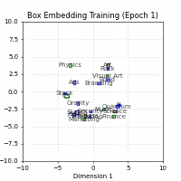

# 📦 Box-Embedding-Unboxed
> **Visualizing Geometric Reasoning & Topological Constraints in 2D Space**


*(여기에 가장 잘 나온 최종 성공 GIF 경로를 넣으세요)*

## 1. Introduction
**"Why Box, not Vector?"**
기존의 벡터 임베딩(Vector Embedding)은 대상을 공간상의 **점(Point)**으로 표현하기 때문에, 개념의 **계층 구조(Hierarchy)**나 **불확실성(Uncertainty)**을 표현하는 데 한계가 있습니다.

이 프로젝트는 **Box Embedding** (Vilnis et al., 2018)의 기하학적 특성(Intersection, Containment)을 2차원 공간에서 직접 구현하고 시각화하여, 모델이 어떻게 논리적 포함 관계를 학습하는지 규명한 연구/구현 프로젝트입니다.

## 2. Key Features
* **Geometric Reasoning:** 2D 공간에서 박스의 교집합(Intersection)과 포함(Containment) 관계 구현.
* **Custom Synthetic Dataset:** 상호 배타적인 3개 도메인(Science, Art, Business)으로 구성된 계층형 데이터셋 설계.
* **Optimization:**
    * **Volume Regularization:** 박스가 무한히 커지는 Trivial Solution 방지.
    * **Aspect Ratio Regularization:** 박스가 십자가(+) 형태로 겹치는 꼼수(Orthogonal Overlap) 차단.

## 3. Experiment & Analysis (Trouble Shooting)
본 프로젝트의 핵심은 2D 공간의 **위상학적 한계(Topological Trap)**를 발견하고, 이를 **Data-Centric**한 방법으로 해결한 과정에 있습니다.

### 3.1. The "Grandchild" Problem (Blocking)
* **Problem:** 2차원 평면은 고차원에 비해 우회로가 부족합니다. 이로 인해 직계 부모(`Jazz` → `Music`) 관계는 학습되지만, 조상(`Jazz` → `Art`) 관계는 중간의 장애물(Negative Samples)에 가로막혀 수렴하지 못하는 **Blocking** 현상이 발생했습니다.
* **Solution (Data-Centric Approach):**
    * 모델의 파라미터를 튜닝하는 대신, **Transitive Closure (이행적 폐포)** 알고리즘을 적용했습니다.
    * 데이터셋에 `(Grandchild, IsA, Grandparent)` 관계를 명시적으로 주입하여, 모델이 중간 장애물을 뛰어넘어 수렴하도록 유도했습니다.

### 3.2. Anisotropy (비등방성)
* **Observation:** 특정 박스들이 세로 혹은 가로로 길게 늘어지는 현상 관측.
* **Analysis:** 이는 모델이 Negative Constraint가 없는 방향(Null Space)으로 박스를 확장하여 Loss를 줄이려는 기하학적 최적화 과정임을 확인했습니다.

## 4. Conclusion
**"Better Data > Better Model"**
초기에는 Learning Rate나 Margin 튜닝에 집중했으나, 근본적인 해결책은 **데이터의 구조적 결함(Transitivity 부족)을 보완**하는 것이었습니다. 이를 통해 AI 모델링에서 아키텍처만큼이나 **데이터의 품질과 구조(Data Quality)**가 성능에 결정적임을 확인했습니다.

## 5. Tech Stack
* **Language:** Python 3.10
* **Framework:** PyTorch
* **Visualization:** Matplotlib, ImageIO

## 6. How to Run
```bash
# 1. Install dependencies
pip install -r requirements.txt

# 2. Train & Visualize
python main.py --epochs 3000 --lr 0.005